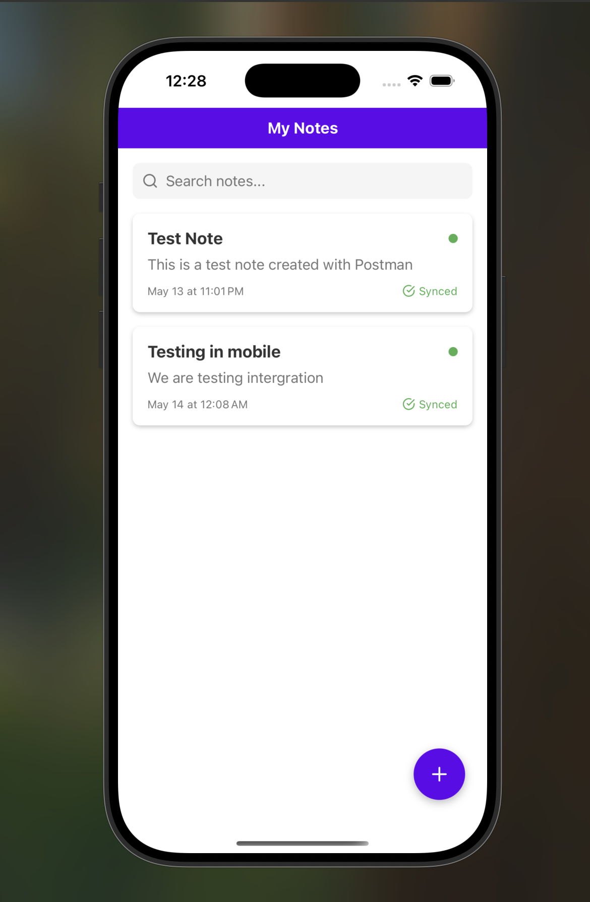
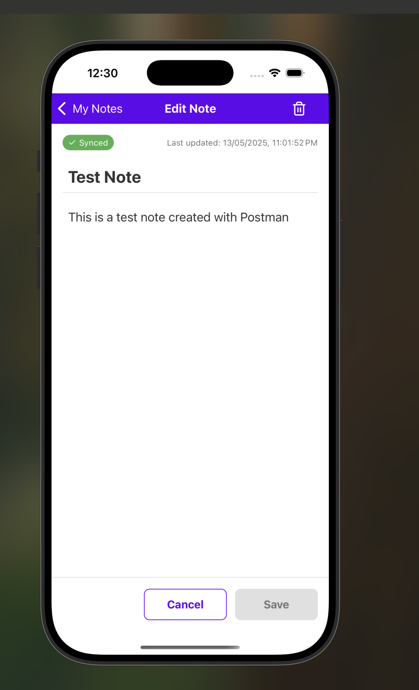
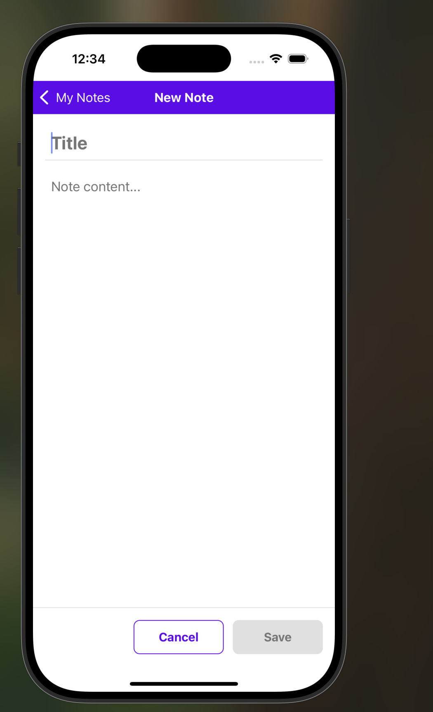

# Notes App - Mobile Client with Offline Sync

  
  
  

This is the mobile client for the Notes Offline Sync application. Built with React Native and Expo, it provides a seamless note-taking experience with offline capabilities and automatic synchronization.

# Features

Create and manage notes with a clean, intuitive interface
Work offline with automatic synchronization when back online
Real-time updates via Socket.IO
Search functionality to quickly find notes
Visual indicators for sync status
Modern UI with consistent theming

# Prerequisites

Node.js (>= 14.x)
npm or yarn
Expo CLI (npm install -g expo-cli)
iOS Simulator or Android Emulator (optional)
Expo Go app on your physical device (optional)

# Installation

Clone the repository

bashgit clone https://github.com/Mizero-eloi/notes_app.git
cd notes-app

Install dependencies

bashnpm install

# or

yarn install

Start the development server

bashnpx expo start

Open the app:

Scan the QR code with the Expo Go app on your device
Press 'i' for iOS simulator
Press 'a' for Android emulator
Press 'w' for web browser

# Project Structure

notes-app/
├── App.js # Entry point
├── src/
│ ├── components/ # Reusable UI components
│ ├── context/ # React Context providers
│ ├── hooks/ # Custom React hooks
│ ├── navigation/ # Navigation configuration
│ ├── screens/ # Main app screens
│ └── services/ # API and storage services
├── assets/ # Static assets
└── package.json

# Context Providers

The app uses React Context API for state management:

ThemeContext: Provides consistent styling
NetworkContext: Monitors network connectivity
NotesContext: Manages notes data and sync operations
SocketContext: Handles real-time communication

# Offline Functionality

Notes created or edited while offline are:

Saved locally using AsyncStorage
Added to a sync queue
Automatically synchronized when the device goes back online

# API Endpoints

The mobile app connects to a backend server that provides these endpoints:

GET /notes - Fetch all notes
POST /notes - Create a new note
POST /notes/batch - Batch upload notes (for offline sync)

# Socket.IO Events

The app listens for these events:

note:created - When a new note is created
note:synced - When a note is synced/updated

# Troubleshooting

# Common Issues

"Unmatched Route" Error:

Make sure there is only one NavigationContainer in your app
Verify that an initialRouteName is set in your navigator

# Theme Context Error:

Ensure the ThemeProvider is wrapping your app correctly
Check that all theme properties are properly defined

# Offline Sync Issues:

Verify NetInfo is correctly configured
Check AsyncStorage implementation for data persistence

# Connecting to Backend

By default, the app connects to a local backend at http://localhost:3000. To change this:

Create a .env file in the project root
Add your backend URL: API_URL=https://your-backend-url.com
Restart the development server

License
MIT
